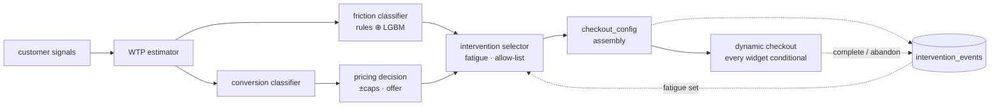

# Architecture — WTP Dynamic Pricing Engine + Cash Flow Oracle

Razorpay AI Buildathon 2026 · Track 01 (AI Growth & Agentic Commerce) — with a
full **Track 04 (AI Cash Flow Oracle)** build in the same monorepo, covered in
§9.

---

## 1. System design narrative

The engine is a thin, fast **decision layer** that a merchant calls once, at
checkout render, before Razorpay payment initiation. It answers a single
question: *given everything we know about this shopper and this cart, what price
and what offer maximise expected revenue without ever charging a price-sensitive
customer more than list?*

It is built as decoupled stages joined by data contracts, so each can be
tested, swapped, or scaled independently. Stages 1–3 and 5 are the pricing
core; stages 4 and 6 are the Friction-Aware Conversion Engine (§3):

1. **IP enrichment** — the raw client IP becomes a trust signal
   (`ip_type`, `ip_trust_multiplier`, `location_confidence`). FireHOL
   blocklists are held in memory as sorted integer intervals (`bisect` lookup,
   no radix-tree dependency); ASN/ISP resolution uses MaxMind GeoLite2 when a
   licence key is present and a deterministic synthetic table otherwise. A
   whitelist of legitimate Indian *shared* ranges (Jio/Airtel/BSNL business,
   IIT/NIT/NKN campus nets, co-working spaces) prevents corporate-NAT and
   campus traffic from being punished as "datacenter". Every result is cached
   in Redis for 24 h. **Fails safe**: any error → `unknown` / `0.8`.

2. **Market context** — festival period + intensity for the date, and the RBI
   digital-payments demand index for the month, are looked up from the data
   pipeline's outputs and merged into the feature vector.

3. **WTP estimator** — a LightGBM regressor predicts a WTP multiplier in
   `[0.85, 1.25]` from ~21 features (device, city tier, income tier, payment
   preference, behavioural history, IP trust, festival context). A
   `shap.TreeExplainer` is **serialised with the model**, so every prediction
   ships with signed per-feature attributions at no extra training cost. A
   secondary LightGBM classifier predicts P(convert) as a function of the
   *offered* price multiplier — the list-price-vs-adjusted-price curve.

4. **Friction classifier** — a hybrid rule + LightGBM multiclass model that
   names the *specific barrier to purchase* for this shopper (primary +
   secondary of six: price sensitivity, trust deficit, decision paralysis,
   payment friction, delivery anxiety, urgency-insensitive), with a confidence
   score and plain-English drivers. Runs after WTP, before the price. See
   §3 for the architecture and training.

5. **Pricing decision engine** — a **deterministic**, rules-only layer (no
   model calls, no randomness) turns those numbers into a concrete checkout
   treatment: `final_price` (hard-capped at **+15 % / −10 %** of list),
   `offer_type` (premium-experience perks for high WTP, discount nudges for
   low WTP / weak conversion), a **personalised payment-method order**, COD
   and instant-refund eligibility, a plain-English `reasoning` string that
   cites the top-2 SHAP features, and a `confidence` grade.

6. **Checkout assembly** — the friction call + the priced decision feed an
   intervention library that emits a `checkout_config` object: which price
   display (EMI / full / anchored), which 1–2 interventions, trust badges,
   payment order, COD-split offer, delivery promise, social-proof counter,
   urgency (gated to ≥3 min of session time), and the shopper-facing
   "why this price / why this offer" copy. The Next.js checkout renders
   **entirely** from this object — no widget is hard-coded. See §3.

The API wraps these with CORS, request logging, a model warm-up on startup, and
a hard latency ceiling: `POST /personalize` returns **503** if it exceeds
`LATENCY_BUDGET_MS` (default 200). Every decision — inputs, WTP score, SHAP
values, final price, offer, latency, session id — is logged to PostgreSQL
(async, best-effort; in-memory ring buffer if the DB is down).

### Demo layer: link generator + sessions

On top of the pricing core sits a thin session layer for the panel demo:

- `POST /session/create` takes a **preset** (`random` / `high` / `mid` / `low`
  / `custom`). `api/presets.py` turns the coarse knobs a merchant would actually
  have (pincode → city tier, device, payment preference, prepaid-order count,
  return rate, VPN flag) into the full behavioural feature vector — trust
  score, payment-success rate, COD-completion rate, account age. It returns a
  `session_id`, a **customer URL** (`/checkout/{id}`), a **merchant URL**
  (`/merchant/{id}`), and a **QR PNG** (data URI, `qrcode`).
- The customer's `POST /personalize` carries the `session_id`; the API links
  the decision back to the session (`pending → priced → converted`) and
  **broadcasts** the update over `WS /ws/sessions` so the seller dashboard's
  live table moves without polling.
- `GET /segment/stats/{key}` computes a **Normal-Normal Bayesian posterior**
  over the segment's WTP multiplier from the logged decisions — posterior mean,
  95% credible interval, a conversion-probability curve across price points,
  and a segment-level revenue-vs-flat simulation. This is what the merchant
  view renders alongside the per-decision SHAP waterfall.

The session store shares the Postgres pool and degrades to an in-process dict
just like the decision log, so the whole demo runs with zero infra.

---

## 2. Data-flow diagram

```mermaid
flowchart TD
    subgraph Merchant
        CO[Checkout page]
    end

    subgraph "Pricing API  (< 200 ms)"
        direction TB
        RX[POST /personalize\ncustomer_signals + IP]
        IPE[IP Enrichment\nFireHOL · MaxMind/synthetic · whitelist\nRedis cache 24h]
        CTX[Market context\nfestival · RBI demand index]
        WTP[WTP Estimator\nLightGBM regressor + SHAP]
        CONV[Conversion classifier\nP(convert | offered price)]
        FRIC[Friction classifier\nrules ⊕ LightGBM multiclass\nprimary + secondary + drivers]
        PE[Pricing Decision Engine\ncaps ±15/−10% · offer · payment order\nCOD / refund eligibility · reasoning]
        INTV[Intervention selector\nlibrary lookup · fatigue rotation\nmerchant allow-list]
        ASM[Checkout assembly\ncheckout_config: price display · widgets\nurgency gate · why-this-price copy]
        RESP[PricingResponse\nprice · offer · SHAP · friction · checkout_config]
    end

    subgraph Datastores
        RD[(Redis\nIP cache)]
        PG[(PostgreSQL\npricing_decisions\nintervention_events · sessions)]
    end

    subgraph "Offline  (data-pipeline + model)"
        RBI[RBI DBIE\ndigital payments]
        GT[Google Trends\ncategory interest]
        FES[Festival calendar\n2022–2026]
        FH[FireHOL blocklists]
        SYN[50k synthetic\ntransactions]
        TRAIN[LightGBM training\n+ SHAP + plots]
        FTR[Friction training\nrule labels + 15% noise\ninverse-freq weights]
    end

    CO -->|customer signals + IP| RX
    RX --> IPE
    IPE <-->|get/set| RD
    IPE --> CTX --> WTP --> CONV --> FRIC --> PE --> INTV --> ASM --> RESP
    RESP -->|dynamic checkout| CO
    RESP -->|async log: inputs, wtp, shap, price, friction, checkout_config| PG
    ASM -.->|intervention shown / settled outcome| PG

    RBI --> SYN
    GT --> SYN
    FES --> SYN
    SYN --> TRAIN
    SYN --> FTR
    TRAIN -->|wtp_estimator.joblib\nconversion_classifier.joblib| WTP
    TRAIN --> CONV
    FTR -->|friction_classifier.joblib| FRIC
    FES --> CTX
    RBI --> CTX
    FH --> IPE
```

---

## 3. Friction-Aware Conversion Engine

The pricing core answers *what price*. This layer answers *why isn't this
shopper converting, and what one change fixes it* — turning a pricing engine
into a conversion-optimisation system. Four parts.

### 3.1 Friction classifier  (`api/friction_engine.py`, `model/train_friction.py`)

For every checkout it names a **primary** and **secondary** friction from six:

| Friction | Signature |
|---|---|
| `price_sensitivity` | low WTP, Tier 3, COD-leaning, high returns, thin AOV |
| `trust_deficit` | new account, VPN/DC network, low cross-merchant trust, few merchants |
| `decision_paralysis` | abandons carts, late-night session, repeat visits, WTP on the fence |
| `payment_friction` | COD-preferring but COD-ineligible, card-first shown to a UPI shopper, weak payment-success history |
| `delivery_anxiety` | high returns, Tier 2/3, electronics / high-value, first buy in category |
| `urgency_insensitive` | high WTP, repeat buyer, morning, Tier 1 — wants quality signals, not a countdown |

**Hybrid, transparent-first.** A rule scorer assigns each friction a 0–1 score
from the raw signals (documented coefficients a merchant can reason about — e.g.
`price_sensitivity = 0.38·(1−wtp_norm) + 0.18·(tier==3) + 0.18·(return_rate/0.4) + …`).
That vector is soft-maxed (temp 0.35) and **blended 50/50** with a LightGBM
multiclass classifier's calibrated probabilities. If the model artifact is
absent the engine degrades to pure rules. Confidence is
`clamp01(0.45 + 0.9·(top − 2nd) + 0.25·(top − 1/6))` — a function of how far
the winner leads.

**Training methodology.** There is no labelled friction data, so
`model/train_friction.py` labels all 50k synthetic transactions by the rule
scorer's arg-max, **injects 15% uniform label noise** (so the model can't just
re-learn the rules and instead picks up feature interactions), and adds
**inverse-frequency sample weights** (clipped at 8×) so rare frictions aren't
ignored. LightGBM `multiclass` / `num_class=6`, 900 rounds, `force_col_wise`.
Reported: accuracy ≈ 0.80, macro-F1 ≈ 0.69, rule-agreement ≈ 0.93. Inference is
numpy-only (row built in `model.feature_name()` order, categoricals via the
frozen maps, three derived features) — **≈ 1 ms**, keeping `/personalize`
≈ 40 ms warm.

### 3.2 Intervention library  (`api/interventions.py`)

Each friction has a **primary / secondary / tertiary** intervention. Every entry
carries an `id` (logged), a `display_component` (which checkout widget renders
it), the exact templated `copy`, the `psychological_mechanism` it exploits, and
a synthetic `expected_conversion_lift` range anchored to published e-commerce
research (Baymard cart-abandonment work, EMI/BNPL conversion studies,
social-proof field experiments). Examples:

| Friction | Primary | Mechanism |
|---|---|---|
| price_sensitivity | `emi_breakdown` | payment decoupling — a big number reframed as a small recurring one |
| trust_deficit | `social_proof_counter` | social proof — others' behaviour as evidence under uncertainty |
| decision_paralysis | `comparison_eliminator` | choice-overload relief — an external ranking ends the search |
| payment_friction | `payment_reorder` | friction removal — preferred method first and pre-expanded |
| delivery_anxiety | `delivery_promise` | uncertainty reduction — a firm date beats "3–5 business days" |
| urgency_insensitive | `quality_signal` | confirmation — a high-WTP buyer wants reassurance, not a timer |

Helpers compute the concrete artefacts: EMI schedule (0% shown), a
category-anchored "market price" (`max(1.55·AOV, 1.24·final)` rounded),
trust-scaled COD split (`upfront% = clamp(round((70−trust)/3), 10, 30)`), a
specific delivery date by PIN tier, deterministic synthetic stock, a
profile-keyed review snippet, and friction-relevant trust-badge selection.

### 3.3 Checkout assembly  (`build_checkout_config`)

Merges the friction call + `PricingDecision` into the `checkout_config` object
the frontend renders from. Rules that matter:

- **`price_display`** ∈ `full | emi | anchored`; a **markup is never anchored**
  (no fake struck price over an above-list number).
- **Urgency** is written only when `session_minutes ≥ 3` **and** synthetic stock
  is genuinely low — `urgency_min_seconds = 180` is passed through and the
  client re-checks against real session time, so it can never show on first load.
- **Fatigue rotation** — `_pick` walks primary → secondary → tertiary, skipping
  any `fatigued_intervention_ids`; the **merchant allow-list**
  (`MerchantConfig.interventions`) filters the same way.
- Social-proof counter is seeded from the live session count and marked
  `social_proof_live` so the client ticks it via the `/ws/sessions` feed.

### 3.4 A/B simulator, funnel, performance tracker

- **`POST /simulate/ab_test`** (`api/ab_test.py`) — builds a synthetic cohort
  around a segment, splits it 50/50, runs **control** (flat list price, no
  intervention) vs **treatment** (WTP price + friction-aware intervention).
  Conversion is a Bernoulli draw from the conversion classifier at each arm's
  price; treatment additionally applies the primary intervention's published
  relative uplift (secondary at 35% weight). Reports per-arm conversion / RPV,
  the lift, a **pooled two-proportion z-test** p-value, and an **unpooled Wald
  95% CI** on the conversion-rate lift. One vectorised `simulate_cohort` pass
  (one feature build + three batched predicts) does a 2.5k cohort in ~2–3 s
  instead of ~90 s; runs off the event loop.
- **`GET /funnel`** (`api/funnel.py`) — four stages
  `page_load → profile_submitted → payment_selected → order_confirmed`.
  `order_confirmed` is the conversion classifier's probability; the two
  intermediate stages use a transparent per-stage base retention adjusted by
  the shopper's friction (× confidence), then **rescaled so the funnel product
  equals the modelled conversion probability** — the shape is synthesised, the
  endpoint is real. Drop-off at each step is attributed to friction type and to
  the intervention that targets it. Mixes in a synthetic cohort while the live
  log is small.
- **`GET /interventions/performance`** (`api/intervention_perf.py`) — every
  intervention *shown* is logged to `intervention_events` (outcome `NULL` until
  the session hits complete/abandon, which stamps it). Aggregates conversion
  rate + revenue-per-shown per intervention, lift vs the settled baseline,
  common frictions per product category, and **fatigued `(segment, intervention)`
  pairs** — 3+ shows, zero conversions — which `db.fatigued_interventions`
  feeds back into `build_checkout_config` so the assembler rotates away.

### 3.5 Friction-engine data flow



---

## 4. Tech stack — one-line justifications

| Choice | Why |
|---|---|
| **Python 3.11 + FastAPI + uvicorn** | Async I/O for the enrichment/DB calls, Pydantic validation for a clean merchant-facing contract, first-class OpenAPI docs. |
| **LightGBM** | Best-in-class tabular accuracy, native categorical handling (no one-hot blow-up), millisecond single-row inference — fits the 200 ms budget with room to spare. |
| **SHAP `TreeExplainer`** | Exact, fast Shapley values for trees; every price is explainable to the merchant and the shopper, and drives the `reasoning` text. |
| **Deterministic rules engine (plain Python)** | Pricing policy must be auditable and unit-testable; ML sets the *target*, rules enforce the *guardrails* (caps, eligibility, offer logic). |
| **PostgreSQL + asyncpg** | Durable decision log for analytics / audit / revenue-lift measurement; `asyncpg` keeps logging off the critical path. |
| **Redis (`redis.asyncio`)** | 24 h IP-enrichment cache so repeat shoppers cost ~1 ms, not a fresh blocklist+ASN pass. |
| **MaxMind GeoLite2 (`geoip2`)** | Industry-standard offline IP→ASN/geo; free tier; no per-request network call. |
| **FireHOL blocklist-ipsets** | Community-maintained, frequently-updated VPN/DC/Tor/bogon ranges; loaded once into memory. |
| **pytrends / RBI DBIE** | Ground the synthetic data in *real* Indian demand seasonality and payment-mix trends. |
| **Next.js 14 + Tailwind + Recharts** | App-router routes for `/dashboard`, `/checkout/{id}`, `/merchant/{id}`, `/merchant/dashboard` (conversion analytics: funnel, A/B, intervention performance); utility CSS for a polished demo quickly; Recharts for the metric charts, conversion curve, SHAP waterfall, and A/B bars. The customer checkout renders **entirely from `checkout_config`** — every widget conditional. |
| **FastAPI WebSocket + `qrcode`** | `/ws/sessions` pushes session updates to the seller dashboard (no polling); `qrcode` renders the customer link as a scannable PNG for the phone demo. |
| **Prophet + `arch` (GARCH) + `hmmlearn`** (Track 04, §9) | Settlement forecasting needs trend/seasonality (Prophet), volatility clustering (GARCH), and discrete regime detection (HMM) — three complementary views. All three degrade to statistical fallbacks; the Render deploy runs on the fallbacks. |
| **`anthropic` SDK** (Track 04, §9.4) | The Cash Flow Oracle's CFO recommendation is a real Claude generation over the merchant's full context — templates can't join five inputs into advice that reads like a person wrote it. 6-hour PG/SQLite cache; template fallback when the key is absent. |
| **Docker Compose** | One command brings up PG + Redis + seeder + API + dashboard with correct boot ordering and health gates. |
| **joblib** | Simple, compressed serialisation of the model **and** its SHAP explainer as one bundle. |

---

## 5. Latency budget

Target: **end-to-end `POST /personalize` < 200 ms**. Measured stage costs
(local, warm, in-process cache):

| Stage | Budget | Measured (typ.) | Notes |
|---|---:|---:|---|
| IP enrichment (cache hit) | 5 ms | **0.1–0.5 ms** | sorted-interval `bisect`; Redis GET on miss |
| Market context lookup | 1 ms | **~0.02 ms** | in-memory dicts from pipeline CSVs |
| WTP model inference + SHAP | 50 ms | **3–18 ms** | single-row LightGBM predict + `TreeExplainer` |
| Conversion model (list + adjusted) | 30 ms | **2–30 ms** | two single-row predicts |
| Friction classifier (rules ⊕ LGBM) | 10 ms | **~1 ms** | numpy-only row build + one multiclass predict |
| Pricing decision engine | 10 ms | **< 0.1 ms** | pure Python arithmetic + string build |
| Checkout assembly (`checkout_config`) | 5 ms | **< 0.5 ms** | library lookup + fatigue set (in-mem) or one GROUP BY |
| DB log + intervention log (async, off path) | 0 ms | **0 ms** | `await` after the response is assembled; best-effort |
| **Total** | **< 200 ms** | **~40–70 ms warm** | first request after boot is pre-warmed in the lifespan hook |

Headroom is deliberate: it absorbs a cold Redis miss, a real MaxMind lookup, and
network jitter between the merchant and the API while still clearing 200 ms. The
middleware returns **503** (not a stale price) if the ceiling is ever breached.

---

## 6. Ethical framing — segmentation, not exploitation

**What this system does:** it prices to *observable segment characteristics*
(device class, city tier, neighbourhood income tier, payment-method mix,
return behaviour, network trust), the same variables a merchant already uses for
shipping thresholds, COD eligibility, and ad targeting. It is **second-degree /
third-degree price discrimination** — the economics term for "student
discounts" and "off-peak fares" — not surveillance-based individual extraction.

**Guardrails that make it defensible:**

- **Hard, symmetric-ish caps.** No shopper ever pays more than **+15 %** of
  list; no price is cut more than **−10 %**. The band is small and fixed in
  code, not learned.
- **Low-trust / price-sensitive shoppers are never charged *more* than list.**
  The model pushes their multiplier *down*; the engine gives them the discount
  nudges (free delivery, 5 % cashback). The downside risk lands on the
  merchant's margin, not the vulnerable customer.
- **No protected attributes.** No name, gender, caste, religion, or precise
  location. City tier and income tier are coarse, area-level, and public-census
  derived.
- **Every price is explained.** The `reasoning` string and SHAP attributions
  are returned on every call and logged — a merchant (or a regulator) can see
  exactly why a price was shown.
- **Deterministic policy.** Given the same inputs the decision is identical and
  reproducible; there is no per-user random experimentation on price.

**Why it benefits both sides:**

- *Merchant* — recovers margin from low-price-sensitivity segments (premium
  device + metro + credit card) and rescues conversions from high-sensitivity
  segments with targeted nudges instead of a blanket sitewide discount. The
  `/metrics` revenue-lift simulation quantifies this.
- *Consumer* — a price-sensitive shopper in a Tier-3 town gets a *better* price
  and a delivery/cashback sweetener; a high-intent shopper gets premium-service
  perks (extended warranty, priority support, instant refund) rather than being
  nickel-and-dimed. COD and instant-refund eligibility expand as cross-merchant
  trust grows, which is a consumer benefit the shopper earns.

**What we would not ship:** uncapped pricing, individual-level price memory
("this user paid ₹X last time, try ₹X+10 %"), scarcity/urgency dark patterns
tied to the price, or any use of protected attributes. None of those are in the
codebase and the cap constants are the first thing a reviewer should check
(`api/pricing_engine.py`).

---

## 7. Known limitations & what changes with real Razorpay data

| Limitation today | With real Razorpay transaction data |
|---|---|
| **Synthetic ground truth.** `actual_wtp` is generated by a known additive model, so R² ≈ 0.91 is partly "the model finding the generator". | Train on realised outcomes: A/B'd price exposures → actual conversion and realised revenue. WTP becomes a *latent* target estimated from price-response curves, not a label. |
| **Conversion classifier is weak (AUC ≈ 0.72)** because synthetic conversion has a lot of injected noise. | Real click→pay funnels with true negatives give a much sharper price-elasticity model per segment. |
| **IP enrichment runs in mock-geo mode** unless a MaxMind key is supplied; synthetic ASN resolution is deterministic but arbitrary for unknown IPs. | Drop in the GeoLite2 `.mmdb` files (or Razorpay's own IP intelligence) — `geo_source` flips to `maxmind`, `location_confidence` becomes meaningful. |
| **Behavioural signals are merchant-supplied in the request.** | Razorpay already sees cross-merchant payment success, COD completion, and tenure — these become server-side lookups, not client inputs, and can't be spoofed. |
| **Cross-merchant trust score is a hand-tuned formula.** | Replace with Razorpay's existing risk/trust score. |
| **Festival calendar and RBI demand index are static files.** | Live feeds; per-category, per-region demand nowcasting. |
| **No holdout / guardrail monitoring in production.** | Always keep a control slice at list price to measure true lift and detect model drift; alert if realised margin or conversion drops. |
| **Single-region, single-currency.** | Multi-currency, GST-inclusive display rules, state-level COD policies. |
| **Friction labels are rule-derived, not observed.** The classifier is trained on its own rule scorer's arg-max (+15% noise), so it learns feature interactions around a hand-built prior, not real abandonment causes. `expected_conversion_lift` per intervention is a literature-anchored guess, not measured. | Label friction from real session telemetry (rage-clicks, field re-edits, payment retries, time-on-step) and outcomes; learn per-segment lift from the live `intervention_events` log instead of the library constant. |
| **A/B simulator and funnel are synthetic.** The A/B cohort is generated, conversion is a Bernoulli draw from the (weak) conversion model plus the library uplift; the funnel's two middle stages are a retention model rescaled to the modelled conversion probability, not measured drop-off. | Both become read-only views over real experiment / clickstream data; the simulator keeps its value only as a pre-launch power/sizing tool. |

### On the statistics (what a sharp reviewer should poke at)

- **Segment posterior** (`api/segment_stats.py`) — a proper Normal-Inverse-Gamma
  conjugate update (unknown mean *and* variance), so the 95% interval is a
  **Student-t** interval with `nu = 2*a_n` dof, not a z-interval. It is
  **clipped to [0.85, 1.25]** because WTP is truncated at the price band — an
  un-clipped Normal CI would poke past the cap. Still: the "observations" are
  the estimator's *predicted* WTP for past shoppers, not realised WTP, so this
  is a posterior over *model output per segment*, not a causal WTP estimate.
  Response is labelled `measures: "model-predicted WTP multiplier"`.
- **Conversion-probability curve** in the segment view reuses the logistic
  price-response shape the synthetic generator was built with
  (`sigmoid(8.5 * (WTP - offered))`). With real data this comes from the fitted
  conversion classifier, which would also need Platt/isotonic **calibration**
  before its probabilities feed a revenue number.
- **Revenue-lift simulation** is *expected revenue per impression*
  (`price x P(convert)`), summed over logged decisions. It **ignores
  margin/COGS** (so it understates profit lift on a markup), ignores
  repeat-purchase/LTV, assumes the conversion model is calibrated, and is
  **sensitive to sample size and the segment mix** of whatever traffic has been
  logged. The endpoint returns a `caveat` string saying exactly this; treat the
  headline % as directional, not a forecast.
- **SHAP waterfall** sums (base + all contributions) to the model's **raw**
  output; the price shown is that value **clipped** to +15%/−10%. The merchant
  view shows both and labels the capped case, so the additive identity stays
  visibly exact.
- **A/B simulator** (`/simulate/ab_test`) uses a **pooled** two-proportion
  z-test for the p-value (correct null SE) and an **unpooled** Wald interval for
  the 95% CI on the conversion-rate difference (correct under the alternative) —
  `Φ` via `math.erf`, no SciPy. Arms are an independent 50/50 split of one
  synthetic cohort, so the test's independence assumption holds; the reported
  `expected_conversion_rate` is the pre-sampling analytic mean, separating the
  signal from Monte-Carlo noise. It is **not** multiplicity-corrected and the
  effect size is only as trustworthy as the conversion model + the library
  uplift constants.
- **Funnel** (`/funnel`) — only `order_confirmed` is a modelled probability. The
  two intermediate stages are `base_retention + friction_delta·confidence`, then
  the last leg is **rescaled** so `p₂·p₃·p₄ = P(convert)`; drop-off is *assigned*
  to the shopper's named friction, not *inferred* from behaviour. Honest label:
  a friction-attributed decomposition of the model's conversion number, not a
  measured funnel.
- **GARCH(1,1) multi-step** (Track 04) uses the textbook recursion
  `sigma^2_{t+h} = omega + (alpha+beta) sigma^2_{t+h-1}`, which mean-reverts to
  `omega/(1-alpha-beta)` on its own — no ad-hoc blending.

### Environment notes

- Docker Desktop hung on startup once (stale socket) — fixed by renaming
  `%LOCALAPPDATA%\Docker\run`. After that the full `docker compose` stack was
  built and verified (`scripts/verify_stack.sh`, 26/26).
- **Backend cannot run on Vercel** — `/ws/sessions` needs a long-lived process
  (no WebSocket servers on Vercel functions) and the LightGBM + SHAP + SciPy
  bundle far exceeds the serverless size limit. Frontend → Vercel, backend →
  Railway/Render (a container host). The dashboard falls back to polling
  `/sessions/all` if the WebSocket can't connect.

---

## 8. What broke during development

<!-- Fill this in with the real war stories after the build. Seed notes: -->

- **numpy 1.x / 2.x ABI break.** The host Python had `numpy 2.2` but `pandas
  2.0.2` (pinned by an unrelated global package), giving
  `ValueError: numpy.dtype size changed`. Fixed by giving the project its own
  venv with the pinned `requirements.txt` (`numpy 1.26.4` + `pandas 2.2.2`).
  Lesson: never share a Python env with a data project.
- **`shap` vs `numpy` version constraint.** `shap 0.51` requires `numpy>=2`;
  had to pin `shap 0.45.1` to stay on the `numpy 1.26` line that `lightgbm` +
  the rest of the stack were happy with.
- **FireHOL list names changed.** `datacenters.netset` and `vpn.netset` were
  retired from the repo root (404). Mapped `vpn.netset` → `firehol_anonymous.netset`
  (2.8 M CIDRs — added a `FIREHOL_MAX_ENTRIES` cap so startup stays fast) and
  kept a curated sample for `datacenters.netset`.
- **`pytrends` + `urllib3 2.x`.** `Retry.__init__() got an unexpected keyword
  argument 'method_whitelist'` — pytrends 4.9.2 uses the old urllib3 API. The
  calibrated synthetic Trends series is used as the fallback.
- **Hyphenated module dir.** The brief mandates `ip-enrichment/`, which isn't a
  legal Python module name. `api/_bootstrap.py` registers it as `ip_enrichment`
  via `importlib` with an explicit `submodule_search_locations`.
- **`build_features` default bug.** `dict.get("income_tier", "mid")` returned
  `None` (the key existed with a `None` value from the Pydantic model), which
  encoded to `-1` "unseen". Switched to `raw.get(k) or default` throughout.
- **SHAP display values.** Early responses showed encoded integers
  (`device_type = 2.0`) in the reasoning. `inference.py` now keeps the
  pre-encoding frame alongside the encoded one and reports the human value.
- **Docker Desktop hung on startup** (corrupted emulated-socket file in
  `%LOCALAPPDATA%\Docker\run\`). Fix: kill the Docker processes, **rename** (not
  delete — the NTFS reparse point resists delete) the `run` dir, relaunch. Then
  the full `docker compose` stack was built and verified end to end
  (`scripts/verify_stack.sh` → 14/14).
- **LightGBM training took 20 min inside the Docker Desktop Linux VM** (vs ~12 s
  native). OpenMP oversubscription: 16+ threads busy-spinning on tiny per-round
  work at ~1700 % CPU. Fix: cap `OMP_NUM_THREADS` / LightGBM `num_threads`
  (`_NUM_THREADS` in `model/train.py`, `OMP_NUM_THREADS=4` in the seeder
  service) and `force_col_wise=True`. Training dropped to ~5 s.
- **`GET /decision/{session_id}` 500'd against Postgres** —
  `asyncpg` returns the `INET` column as an `ipaddress.IPv4Address`, which
  Pydantic can't serialize. Fixed with a scalar-normaliser in the endpoint that
  also decodes `jsonb`-as-text back to objects.
- **Host ports 5432 and 3000 were already taken** by an unrelated stack. The
  compose host-port mappings are now env-parameterised
  (`POSTGRES_HOST_PORT`, `DASHBOARD_HOST_PORT`, `API_HOST_PORT`,
  `REDIS_HOST_PORT`); container-internal ports are unchanged.
- **Friction inference was 8.5 ms via pandas.** The first cut of
  `FrictionModel._model_scores` built a one-row DataFrame + `S.encode` per call.
  Rewrote it numpy-only (row assembled in `model.feature_name()` order,
  categoricals through the frozen maps, 3 derived features) → **~1 ms**, and
  `/personalize` back to ~40 ms warm.
- **A/B simulator took 94 s for 3k shoppers.** It called `predict()` /
  `conversion_proba()` per synthetic shopper — a pandas build + SHAP per row.
  Added `WTPModel.simulate_cohort()`: one feature build + one encode for the
  whole cohort, then three **batched** predicts (WTP, conv@list, conv@capped-
  multiplier via a single column swap). 2.5k cohort now runs in ~2–3 s; the
  funnel's synthetic fallback uses the same path.
- **Friction archetypes tied at 0.50 confidence.** A COD-preferring Tier-3
  shopper scored `price_sensitivity` and `payment_friction` neck-and-neck.
  Retuned the rule weights (price_sensitivity's COD term 0.16 → 0.10,
  payment_friction's `cod_pref_blocked` 0.42 → 0.58) and retrained — the
  payment-friction archetype now wins cleanly.
- **Friction category maps missed on `city_tier`.** Maps are keyed by strings
  but the signal is an int, so every row got `-1` "unseen" for tier. Fixed with
  `str(signals.get(f))` in the numpy row builder.
- **`tsconfig.tsbuildinfo` got committed** by a stray `tsc --noEmit`. Added
  `*.tsbuildinfo` to `dashboard/.gitignore` and untracked it.
- **Cash Flow Oracle cash curve had every merchant insolvent by October.**
  First cut set `daily_burn = 1.04 x avg_daily_settlement` (the *annual* mean).
  The Sep–Oct forecast sits below that annual mean for almost everyone, so
  `yhat - burn` was consistently negative and the balance fell monotonically.
  Fixed: burn tracks the *recent* 90-day run-rate at `0.93x` (opex is ~93% of
  settlements; the retained margin is the buffer), and the cumulative band
  accumulates as root-sum-square, not a linear sum. Stress coverage dropped
  from 26/30 merchants (all 50+ day periods) to 12/30 (mostly 10–35 days).
- **`stress_freq_fn` signature mismatch.** `peer_comparison` called it with a
  merchant *id* string but the route's implementation expected the merchant
  *dict* -> `AttributeError: 'str' object has no attribute 'get'`. Standardised
  on the dict.

---

## 9. Track 04 — Cash Flow Oracle

A separate product on the same monorepo (and, in the deploy, the same FastAPI
process): a 30–60 day forward view of a merchant's **settlement cash position**
with confidence bands, stress-period detection, and proactive credit timing.
The premise is that Razorpay Capital today is *reactive* — a merchant applies
when they are already short — and the signal to act exists in the settlement
stream weeks earlier. Routes live under `/oracle/*`
(`cash-flow-oracle/api/oracle_routes.py`), mounted on both the standalone CFO
app and `api/main.py`. The Next.js dashboard is `/cash-flow-oracle`.

### 9.1 Why cash-flow prediction is harder than it looks

A merchant's daily net settlement is not a tidy time series. Three effects
interact, and modelling any one in isolation gives a confidently wrong answer:

- **Volatility clustering.** Quiet weeks and wild weeks come in runs — a
  chargeback wave, a viral SKU, a gateway wobble. The *level* forecast can be
  fine while the *band* is badly miscalibrated, which is exactly the number a
  credit decision hinges on.
- **Regime changes.** The same +12% week means "normal Diwali build-up" in a
  high-season regime and "dead-cat bounce" in a stress regime. A single global
  model smears these together; the right buffer differs by 2–3x between them.
- **Festival effects.** Diwali / wedding season / FY-end / monsoon each bend the
  series by 15–110% depending on category, and they *move* year to year with
  the lunar calendar. They also change the *shape* (a pull-forward spike is
  followed by a below-trend correction), so a naive seasonal index over-credits
  the post-festival weeks.

And they compound: a festival spike lands during a high-vol regime, the
post-festival correction can tip a thin-margin merchant into a stress regime,
which widens the band further. You need a model of the level, a model of the
variance, and a model of the discrete state — and they have to talk to each
other.

### 9.2 GARCH + HMM + Prophet — what each contributes

| Model | Answers | What the others can't give |
|---|---|---|
| **Prophet** (`models/forecast_prophet.py`) | the **level**: 30–60 day daily forecast with yearly + weekly seasonality and an 80% interval | trend + multiplicative seasonality with holiday-style structure; a point forecast the merchant can read off a chart |
| **GARCH(1,1)** (`models/garch.py`) on daily settlement returns | the **variance**: a conditional volatility that *clusters* and mean-reverts to `omega/(1-alpha-beta)` | Prophet's interval is homoskedastic-ish; GARCH is what widens the band going into a volatile stretch and tightens it after. The forecast vol also scales the fallback forecaster's band and drives the anomaly sigma. |
| **3-state Gaussian HMM** (`models/regime_hmm.py`) on `[level-vs-trend, abs(return)]` | the **discrete state**: `high_season` / `low_season` / `stress`, re-labelled from raw state ids by fitted mean/vol | neither of the others emits a *regime*; it's what selects the planning number (lower band in stress), the category blurb, and the alert-urgency floor |

Each degrades to a documented statistical fallback (EWMA vol, quantile+vol
regime rules, additive trend x DOW x MOY decomposition) so the endpoint always
returns a sane answer — the Render deploy runs entirely on the fallbacks
(`prophet` / `arch` / `hmmlearn` are a large compiled tree kept in
`cash-flow-oracle/requirements.txt`, out of the Track 01 image). `engine` in
the response says which parts ran real vs fallback.

### 9.3 Cash-position curve

The models forecast *settlements*; the dashboard chart and the stress logic need
a *balance*. The curve is reconstructed:

```
balance[t] = balance[t-1] + settlement[t] - daily_burn
```

anchored at `balance[today] = CASH_ON_HAND_RATIO x trailing-30-day net`
(a merchant holds ~2 weeks of runway, not a month of gross), with
`daily_burn = BURN_RATIO x mean(last 90 days)` — opex scales with the recent
run-rate, `BURN_RATIO = 0.93` leaves the retained margin as the structural
buffer. History is walked backwards from today; the forecast forwards, with the
band accumulating as **root-sum-square** of the daily half-widths (daily errors
partly cancel — a linear sum blows the 60-day band out to nonsense). A
**stress period** is >=3 contiguous forecast days with expected balance below
`operating_threshold` (30% of monthly average settlement). These constants are
the first thing to tune against real data; they are in `config.py`.

### 9.4 LLM recommendation — why template strings fail here

`POST /oracle/llm_recommendation` makes a real Anthropic call
(`CFO_LLM_MODEL`, default `claude-sonnet-4-6`) with the full merchant context —
forecast, regime + confidence, the specific stress window and shortfall, peer
percentiles, and the carry-cost vs late-penalty maths — behind the system
prompt *"You are a CFO advisor for Indian ecommerce merchants... reference
specific numbers, dates, and the merchant's category context. Never use
generic advice."*

Templates were tried first and don't clear the bar for this surface:

- **The advice is a join across five inputs.** "Draw Rs 7.2L by 28 Sep because
  your Diwali build-up peaks 12 Oct and the carry cost (Rs 4k) is a fifth of the
  penalty exposure (Rs 11k)" is a sentence that depends on the forecast trough,
  the disbursement lead, the festival calendar, the penalty rate, *and* the
  peer context. A template that covers the real combinations is a decision tree
  with dozens of leaves, and it still reads like a decision tree.
- **Category voice matters for trust.** A fashion merchant and a grocery
  merchant with the same numeric situation need different framing (discretionary
  vs staples, wedding-season vs monsoon). Merchants discount advice that sounds
  like a form letter — the whole point is that they act on it early.
- **It has to sound like a person.** The template fallback is deliberately
  plain and labelled *"pattern-based"* in the UI; the LLM version is the one
  meant to be persuasive.

The response is **cached in Postgres/SQLite for 6 hours** keyed by a hash of the
salient inputs (merchant, regime, stress shape, net-benefit bucket), so a
merchant reloading the page doesn't re-bill the API. If `ANTHROPIC_API_KEY` is
unset or the call fails, `template_recommendation()` returns a specific,
number-referencing fallback and `source` flips to `"template"` — the dashboard
shows the "AI recommendation unavailable" note and carries on.

### 9.5 Scenario simulator methodology

`POST /oracle/scenario` re-runs the forecast with a **multiplicative factor**
over the shock window. Each shock type has a shape `(sign, in-window fraction,
post-window tail fraction, tail days)`:

| Shock | Sign | In-window | Tail | Rationale |
|---|---|---|---|---|
| `discount_sale` | + | 0.60*mag | -0.20*mag, 10d | volume lift during, pull-forward dip after |
| `marketing_spend` | + | 0.50*mag | +0.20*mag, 14d | lift during + a decaying halo |
| `inventory_purchase` | - | 0.55*mag | +0.10*mag, 7d | cash diverted to suppliers, mild rebound |
| `payment_gateway_outage` | - | 0.90*mag | +0.30*mag, 5d | hard drop, then delayed settlements clear |

The tail decays linearly to zero over `tail_days`. Both the original and shocked
settlement forecasts are pushed through the **same** cash-curve reconstruction
(same opening balance and burn), so the delta is attributable purely to the
shock. The response reports the end-of-horizon and worst-point balance deltas,
the stress periods **before vs after**, and the *new* ones introduced (windows
not present in the baseline) with an updated carry-cost recommendation if the
stress picture changed. Runs are persisted to `scenario_runs` keyed by
`merchant_id` + `scenario_id`.

This is a *what-if* tool, not a forecast: the shock shapes are stylised, and a
real integration would learn them from the merchant's own history of
sales / marketing events.

### 9.6 Peer benchmarking — anonymisation

`GET /oracle/peers/{merchant_id}` positions a merchant against **same-category**
peers (same city tier too when that group has >=3 members, else category-only —
stated in `peer_group`). What crosses the wire:

- **No peer identities.** Only the *distributions* — sorted arrays of peer
  settlement volatility and average daily settlement — plus aggregate min / max
  / mean, and the requesting merchant's **percentile rank** within them. The
  histogram the UI draws is built from the distribution array; no row maps back
  to a merchant.
- **Derived, low-cardinality metrics only.** Volatility (a unitless ratio) and
  an average — not raw settlement series, not dates, not transaction counts.
- **Small-group guard.** With `n_peers < 3` the tier constraint is dropped so a
  percentile is never computed against one or two identifiable businesses.
- **Stress frequency** is a heuristic from stored volatility
  (`2 + 8*clamp((vol-0.2)/0.5)` periods/year), not a per-peer settlement scan —
  it avoids fetching every peer's history to answer a comparison question.

In a real deployment the peer set is large and the same rules apply: ship
percentiles and bucket counts, never joinable rows.

### 9.7 Oracle data flow

```mermaid
flowchart TD
    subgraph Offline
        GEN[Synthetic generator\n30 merchants x 3y daily settlements\nDiwali / wedding / monsoon / FY-end]
        SEED[seed.py\nper-merchant avg_daily / GARCH vol / threshold]
        GEN --> SEED
    end

    subgraph Store["SQLite / Postgres"]
        M[(merchants\n+ city_tier, thresholds,\ndisbursement, penalty)]
        S[(merchant_settlements)]
        SC[(scenario_runs)]
        LC[(llm_recommendations - 6h cache)]
    end
    SEED --> M
    SEED --> S

    subgraph API["/oracle/*  (statistical fallbacks on Render)"]
        SER[series fetch]
        GAR[GARCH(1,1)\nconditional + forecast vol]
        HMM[3-state HMM\nregime + confidence]
        PRO[Prophet / additive\n60-day level + band]
        CASH[cash-position curve\nopening / burn / RSS band]
        STR[stress periods\nbelow operating_threshold]
        PEER[peer_comparison\npercentiles only]
        ANOM[anomaly scan\nabove 1.5 / 2.0 sigma]
        CARRY[carry-cost + apply-by\ntrough minus disbursement_days]
        LLM[Claude recommendation\n+ template fallback]
        ALERT[alert_preview\nurgency from stress timing]
    end

    S --> SER --> GAR --> PRO
    SER --> HMM
    GAR --> CASH
    PRO --> CASH --> STR
    M --> CASH
    M --> PEER
    SER --> ANOM
    STR --> CARRY --> LLM
    HMM --> LLM
    PEER --> LLM
    LLM <--> LC
    SC -. persisted .- CASH
    STR --> ALERT
    HMM --> ALERT

    subgraph UI["/cash-flow-oracle"]
        HERO[Cash Forecast hero\nchart + 3 stat cards]
        REG[Regime panel]
        CRED[LLM credit card\n+ timing optimiser]
        WA[WhatsApp alert mockup]
        SIM[Scenario simulator]
        BENCH[Peer benchmarking]
        FEED[Anomaly feed]
        FP[Settlement fingerprint\n7x52 + festival curves]
    end
    CASH --> HERO
    HMM --> REG
    LLM --> CRED
    CARRY --> CRED
    ALERT --> WA
    CASH --> SIM
    PEER --> BENCH
    ANOM --> FEED
    SER --> FP
```
